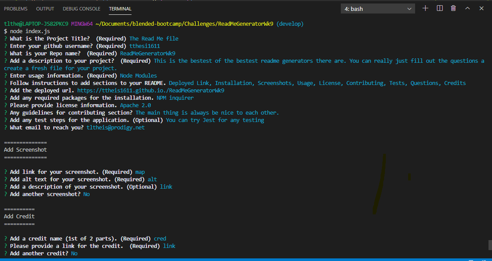

# README Generator
[](https://github.com/ttheis1611/ReadMeGeneratorWk9/issues) [](https://github.com/ttheis1611/ReadMeGeneratorWk9/graphs/contributors) 


## Description
This is a readme generator using node inquirer 

## Contents
* [Installation](#installation)
* [Usage](#usage)
   * [Screenshots](#screenshots)
* [Contributing](#contributing)
* [Credits](#credits)
* [Tests](#tests)
* [Questions](#questions)
* [License](#license)


## Installation
This application needs to install: 
```
To use this tool, you will need to install npm inquirer
```
  
## Usage
node 
  
### Screenshots

Question Input


## Contributing
none
  
## Credits
* [Kelly Gowing](kelly.a.gowing@gmail.com)
* [Milla Decker](https://github.com/deckiedevs/readme-generator)
* [Terry Theis](https://github.com/ttheis1611/ReadMeGeneratorWk9)
* [UTA Starter Code](https://github.com/the-Coding-Boot-Camp-at-UT/UTA-VIRT-BO-FSF)

  
## Tests
To run tests on the application, install
```
noe at this time
```
and run `npm run test` from the command line.
  
## Questions
Created by ttheis1611. 
      If you have any questions about this repo, please contact me at tltheis@prodigy.net.
  
## License
This application is covered under MIT.
  
